# Inspiration for Version 1

I began this project as part of an Independent Study Project assignment for my English class, which was an assignment could create a project of their choice, and work on this project for the next few months to present at the end of April; I decided that I wanted to create something engineering-related that could help people in real-life, leading me to create this project.
## What I was trying to accomplish

My goal is to build an affordable arm using inexpensive electronics, 3D-printed components, and easily obtainable materials.

## Progress
I began the project by researching multiple things: how current prosthetics work, how ancient structures like the pantheon held up for so long(for finger design), how much current prosthetics cost, and types of materials I can use.
Based on my research, I created a sketch of a prototype below:

Next, I made a skeleton for the arm, which used galvanized steel pipes, nuts, and bolts:
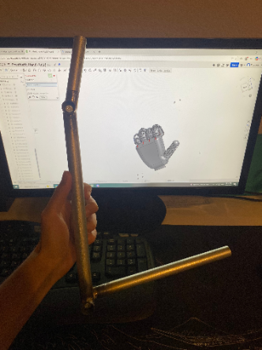
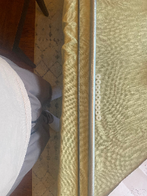
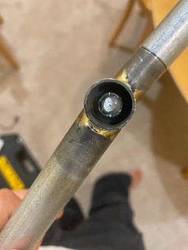

I then created a CAD based on this onshape design, where I added a rib and outer casing layer, similar to the Pantheon, for extra strength(Onshape inspo link: https://cad.onshape.com/documents/258d3cbd698c0f8604d83615/w/486af257ee52051d6e414d3b/e/57aca099e1616bd1490ee5bb):

.png)
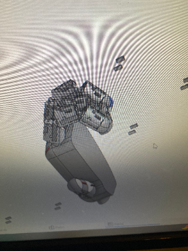
.png)

After CADing the design, I printed the 3D design. I initially attempted to use nails for the joints, but since it failed and created cracks in the joints, I instead decided to glue them together with rubber bands.
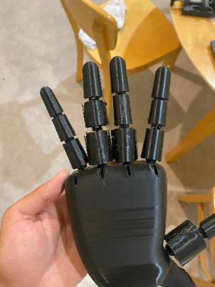
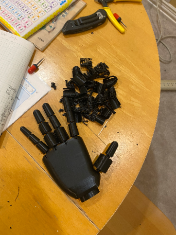
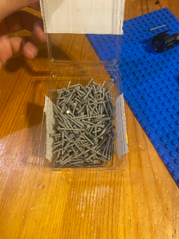
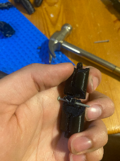

Finally, I connected a PCA servo driver to a Raspberry PI4, programmed it using Thonny Python, and attached the hand to the arm protoype I made. Based on my progress, I made a presentation for the project, linked below:
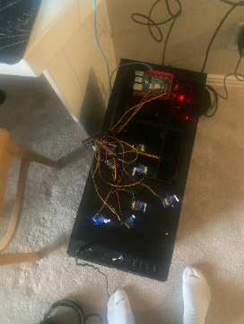
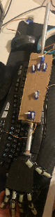
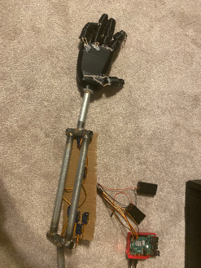
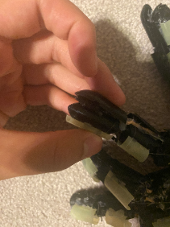
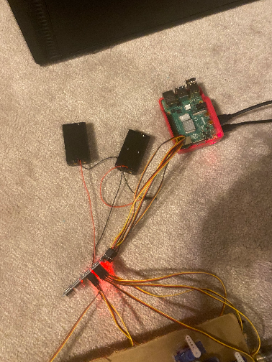

## Parts used:
Fishing line
PCA9685 servo driver
Straws
Hot glue
Nylon Bushings
Nuts
Bolts
Raspberry Pi 4
Batteries + holder
mini servos
